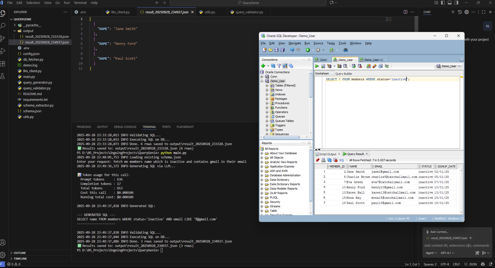

[](https://www.linkedin.com/in/utkarsh--kashyap/)


# 🧠 Ask-DB: Natural Language → Generate SQL Query → Fetch Oracle Data→ JSON

Ask-DB is an **enterprise-grade framework** that converts **plain English requests** into **validated SQL queries**, executes them safely on **Oracle DB**, and saves results in **JSON**.

It’s designed for:
- Data teams who want **ad-hoc queries** without writing SQL.  
- Enterprises that need **guardrails and safety** when exposing DBs to LLMs.  
- Developers who want a **portable, schema-aware demo** (works with both OpenAI and internal custom LLMs).  

---

## 📌 Architecture
```
flowchart TD

    A([📝 User Input - Plain English request from the user])
    B([🛠️ Prompt Builder - Combines schema, example queries, and user input])
    C([🤖 LLM - Generates a single SQL SELECT query based on context])
    D([🛡️ Validator & Guardrails - Checks SQL against schema and blocks harmful operations])
    E([💾 Oracle DB Executor - Runs the validated SQL on the database])
    F([📂 JSON Output - Saves query results as structured JSON files])

    A --> B --> C --> D --> E --> F

```
---

## 🚀 Features (Plain Markdown Summary)
```
- 🔗 Oracle DB integration (local XE or enterprise DB)  
- 📑 Schema extraction with filters  
- 💡 Example queries to guide LLM  
- 🛡️ Guardrails: safe SQL only  
- 👨‍💻 Dual-mode: OpenAI or Custom LLM  
- 📊 Token & cost tracking per request  
- 📂 JSON output with timestamps  
- 📝 Audit logs for governance  
```
---
## 📂 Framework Strucuture
```
Ask-DB/
├── .env.example          # Template env vars (copy → .env)
├── config.json           # Example queries + defaults
├── schema.json           # Auto-generated schema
├── main.py               # Orchestrator
├── utils.py              # Helpers (placeholders, parsing, schema utils)
├── schema_extractor.py   # Extracts schema → schema.json
├── llm_client.py         # Handles API calls (usage + cost tracking)
├── query_generator.py    # Builds LLM prompt & parses response
├── query_validator.py    # Guardrails & schema validation
├── db_fetcher.py         # Executes query, saves JSON
├── requirements.txt      # Python dependencies
├── README.md             # Project documentation
└── output/               # JSON query results
```
---
# 1️⃣ Prerequisites

Python 3.9+

Oracle XE (local) or Oracle Client libraries (for enterprise DB access)

Access to an LLM API (OpenAI API key, or internal custom endpoint)

# 2️⃣ Install
python -m venv venv
source venv/bin/activate   # Linux/macOS
.\venv\Scripts\Activate.ps1  # Windows PowerShell

`pip install -r requirements.txt`

# 3️⃣ Configure

Copy .env.example → .env and fill in details:

Oracle DB connection
ORACLE_USER=demo_user
ORACLE_PASSWORD=demo_pass
ORACLE_DSN=localhost:1521/XEPDB1

LLM (OpenAI or internal LLM)
LLM_API_URL=https://api.openai.com/v1/chat/completions
LLM_API_KEY=sk-your-api-key
LLM_MODEL=gpt-4o-mini

Schema extraction options
SCHEMA_OWNER=DEMO_USER
SCHEMA_TABLES="MEMBERS,ACCOUNTS,TRANSACTIONS"
SCHEMA_MAX_TABLES=50

Output folder
OUTPUT_DIR=./output

# 🛠️ Usage
# Step 1: Extract Schema
`python schema_extractor.py`


This creates schema.json describing tables and columns available to the LLM.

# Step 2: Run a Natural Language Query

CLI one-liner:

`python main.py "Get me all members with gmail emails"`


Interactive mode:

`python main.py
Enter your request: Show all accounts with balance > 3000`

# Step 3: View Results

Results saved as JSON in output/:

`output/result_20250928_231649.json`


Example:
```
[
  {
    "MEMBER_ID": 1,
    "NAME": "John Doe",
    "EMAIL": "john1@gmail.com",
    "STATUS": "activated",
    "SIGNUP_DATE": "2025-01-01T00:00:00"
  }
]
```
🛡️ Guardrails

✅ Only allows single SELECT / WITH queries.

❌ Blocks destructive SQL (DELETE, DROP, UPDATE, TRUNCATE, etc.).

✅ Validates table & column names against schema.json.

✅ Supports table aliases (m.email → MEMBERS.EMAIL).

✅ Ignores false positives inside string literals ('%@gmail.com').

If validation fails:

Framework asks LLM to correct query.

If still invalid, falls back to a safe default query.

---
# 🖼️ Final Execution Screenshot
<p align="lef">
  
</p>
---

# 📊 LLM Usage & Cost Tracking

Every API call prints token and cost usage:

📊 Token usage for this call:
  Prompt tokens     : 680
  Completion tokens : 25
  Total tokens      : 705
  Cost this call    : $0.000191
  Running total cost: $0.000382


Based on GPT-4o mini pricing:

Input: $0.15 per 1M tokens

Output: $0.60 per 1M tokens

Update llm_client.py if using another model.

Helps prevent runaway costs in enterprise setups.

# 🌐 Switching Between OpenAI & Internal LLM

For LLM config:


LLM_API_URL=https://internal.custom.llm/api
LLM_API_KEY=internal-secret-key
LLM_MODEL=custom-model-v1


No code changes required — just swap .env.

⚡ Best Practices for Prod

✅ Use a read-only DB user (SELECT-only).

✅ Limit schema extraction (SCHEMA_TABLES or SCHEMA_MAX_TABLES).

✅ Apply row limits (ROWNUM <= N) in `db_fetcher.py` to avoid huge dumps.

✅ Monitor token usage & costs via built-in tracker.

✅ Log all queries & results (demo.log) for audits. 

📈 Example Run
`$ python main.py "List all transactions in last 30 days"`

📈 GENERATED SQL 
`SELECT * FROM TRANSACTIONS WHERE TRANSACTION_DATE >= ADD_MONTHS(SYSDATE, -1)` 

📈 FINAL SQL 
`SELECT * FROM TRANSACTIONS WHERE TRANSACTION_DATE >= ADD_MONTHS(SYSDATE, -1)` 

✅ Results saved to: output/result_20250928_223501.json (47 rows)

📊 Token usage for this call:
  Prompt tokens     : 720
  Completion tokens : 28
  Total tokens      : 748
  Cost this call    : $0.000200
  Running total cost: $0.000582

# 📚 License & Contributing

For internal enterprise use — customize freely.

Contributions welcome via pull requests.

Keep sensitive data (API keys, DB passwords) in .env, never commit them.

# ✨ Authors & Credits

- 👨‍💻 **Author:** Utkarsh Kashyap  
- 🔗 [LinkedIn](https://www.linkedin.com/in/utkarsh--kashyap/)

Supports Oracle XE for local testing, and Oracle Prod DB in enterprise.

Compatible with OpenAI API and custom LLM endpoints.
